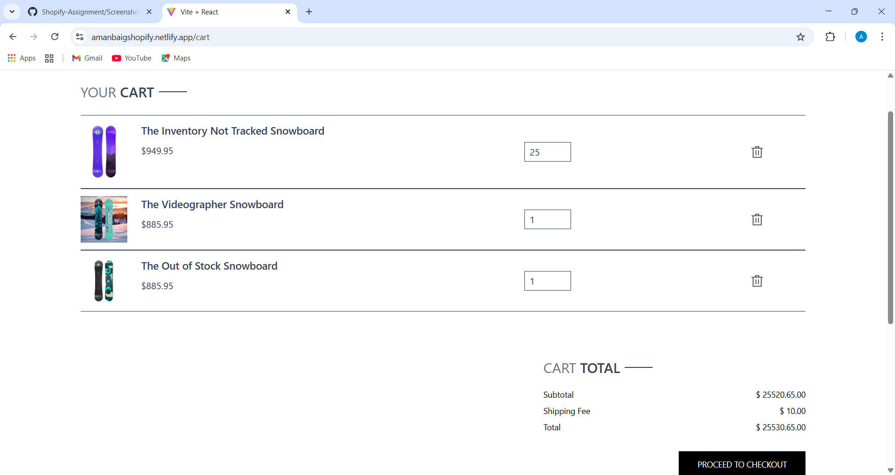

# Shopify Assignment — Custom React Frontend for Shopify 🛍

<!-- Badges -->

---

## Overview

This project is a *React.js frontend* integrated with the *Shopify Storefront API (GraphQL). It demonstrates how to fetch and display products from a Shopify store and present them in a custom, responsive UI built with **Tailwind CSS*.

The README below is structured and highlighted like the Prescripto example so contributors and evaluators can quickly see features, setup steps, queries used, screenshots, and how the project is organized.

---

## 🎯 Quick Links

* Live preview: http://amanbaigshopify.netlify.app
* Repo: https://github.com/amanbaig12/Shopify-Assignment

---

## Screenshots

Add your images into a screenshots/ folder and update these paths:

---

## Table of Contents

* [Overview](#overview)
* [Quick Links](#🎯-quick-links)
* [Screenshots](#screenshots)
* [Features](#features-✨)
* [Tech Stack](#tech-stack-💻)
* [Installation](#installation-🚀)
* [Environment Variables](#environment-variables)
* [Run Locally](#run-locally)
* [GraphQL Queries Used](#graphql-queries-used)
* [Project Structure](#project-structure-📂)
* [What I Learned](#what-i-learned-about-shopify)
* [Contributing](#contributing-🤝)
* [License](#license)

---

## Features ✨

* Fetch and display products from Shopify using Storefront API (GraphQL).
* Product listing with image, title, short description, and price.
* Single product view fetching additional images and variant data.
* Responsive UI built with Tailwind CSS.
* Configurable via environment variables (Vite .env).
* Clean React component structure for reuse and extension.

---

## Tech Stack 💻

* *Frontend:* React.js (Vite)
* *Styling:* Tailwind CSS
* *API:* Shopify Storefront API (GraphQL)
* *Build Tool:* Vite

---

## Installation 🚀

1. Clone the repository

bash
git clone https://github.com/amanbaig12/Shopify-Assignment.git
cd Shopify-Assignment

2. Install dependencies

bash
npm install

---

## Environment Variables

Create a .env file in the project root and add:

env
VITE_SHOPIFY_STORE_DOMAIN=your-store-name.myshopify.com
VITE_SHOPIFY_STOREFRONT_API_TOKEN=your-access-token

> *Tip:* Use a private storefront access token from Shopify admin > Apps > Develop apps > Generate token (Storefront API scopes).

---

## Run Locally

bash
npm run dev

Open the app at: http://localhost:5173/

---

## GraphQL Queries Used 🔍

### Fetch Products (first 10)

graphql
{
  products(first: 10) {
    edges {
      node {
        id
        title
        description
        images(first: 1) {
          edges {
            node {
              src
            }
          }
        }
        variants(first: 1) {
          edges {
            node {
              price
            }
          }
        }
      }
    }
  }
}

### Fetch Single Product by Handle

graphql
{
  product(handle: "sample-product") {
    id
    title
    description
    images(first: 5) {
      edges {
        node {
          src
        }
      }
    }
    variants(first: 1) {
      edges {
        node {
          price
        }
      }
    }
  }
}

> *Note:* Update handle with your product's handle in Shopify.

---

## Project Structure 📂

A simplified structure to help you navigate the frontend code:

src/
├── assets/             # images & static
├── components/         # UI components (ProductCard, Header, Footer)
├── context/            # App-wide state (Shopify context, cart)
├── pages/              # Home, ProductDetail, Cart, NotFound
├── App.jsx             # Root app
├── main.jsx            # Entry point
└── index.css           # Tailwind base styles

---

## How It Works — Implementation Notes

* The project uses a small wrapper around fetch to call the Shopify Storefront API endpoint:
  https://${VITE_SHOPIFY_STORE_DOMAIN}/api/2024-01/graphql.json (or the API version you choose).
* Requests include header X-Shopify-Storefront-Access-Token: ${VITE_SHOPIFY_STOREFRONT_API_TOKEN}.
* Responses are parsed and mapped to React component props (title, images, price).
* Tailwind utility classes are used for layout and responsive design.

---

## What I Learned About Shopify

* How to set up and use the Shopify Storefront API with React.
* Basics of GraphQL queries for fetching products, images, and variants.
* How Shopify structures products, variants, and images in the Storefront API.
* Using Tailwind CSS for quick responsive UI development.
* Designing a simple React app structure that cleanly separates data fetching and UI.

---

## Contributing 🤝

Contributions are welcome! Suggested workflow:

1. Fork the repository
2. Create a feature branch: git checkout -b feature/your-feature
3. Commit changes: git commit -m "feat: add ..."
4. Push and open a Pull Request

Please open issues for bugs or feature requests.

---

## License

This project is open-source. Add a license file (e.g., MIT) if you want to make it explicit.

---

## Footer

If you'd like, I can also:

* Add badges for CI, license, or Netlify/Vercel deployment.
* Generate a LICENSE file and a CODE_OF_CONDUCT.
* Format this as a README.md in your repo and update the screenshot paths.

Happy hacking! ✨
